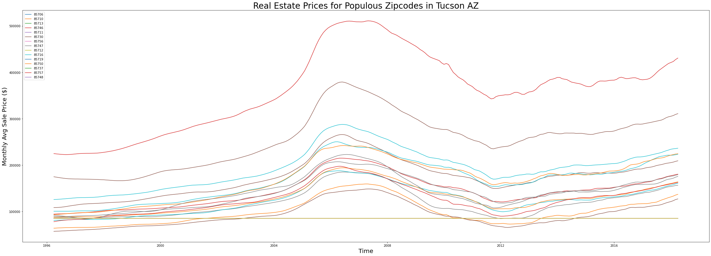

# Scouting New Development Locations with Time Series Forecasting

By: [Dom Garcia](mailto:dlgarcia.017@gmail.com)

# Overview

In this project, I use data on the monthly average of real estate prices across different zip codes to build time series models. These time series models are used to make forecasts about the most profitable retail development locations in the Tucson, AZ metro area.

# Business Problem

[Recent census data](https://www.census.gov/newsroom/press-releases/2019/popest-nation.html) suggests that Arizona is one of the 5 fastest growing states in the nation, in terms of both raw numbers & percent growth.

Currently, Simon Property Group owns [3 retail spaces](https://en.wikipedia.org/wiki/List_of_Simon_Property_Group_properties#Arizona) in the state. They'd like to develop another, given that other states with similar population counts (6.5 - 8.5 million compared to Arizona's 7.15 million) have anywhere from 4-14 properties owned by the group. Since 2 of their Arizona properties are located in the Phoenix metro area, their primary focus is on the state’s next biggest metro:  Tucson.

As part of a team hired by Simon Property, my job is to **use time series analysis of data from Zillow to forecast which zip codes out of the most populous in Tucson will have the best Return on Investment.**

Finally, even though the Zillow data covers housing (and not commercial) real estate, a positive ROI value for residential real estate will be a useful indicator of:

* A projected increase in retail spending & economic growth.  
* A proof of concept for future work with commercial data. 

# Data

The main dataset used in this project is a collection of average monthly real estate prices across US zip codes, provided by [Zillow](https://www.zillow.com/research/data/). Data entries are from 1996 through the first quarter of 2018.  

To obtain population estimates for each zip code of interest, additional data was sourced from [unitedstateszipcodes.org](https://www.unitedstateszipcodes.org/zip-code-database/). 

# Process

Generally, my process adheres to the following steps:

1. Based on population estimates & proximity to Simon Property's Tucson Premium Outlets (determined in part by [this map](https://www.tucsonaz.gov/files/pdsd/wardzip.pdf)), pick the 15 most populous zip codes in the Tucson metro as an initial pool of candidates for development location. 
2. Perform EDA & visualization of data for the chosen zip codes.
3. Create an ARIMA time series model for the price data of each zip code from 2012 onward. 
4. Use these models to forecast future real estate prices in each zip code.
5. Calculate per-zip code ROI projections at 1 month, 6 months & 12 months ahead. 

# Results

To get a feel for each area's relative real estate value, I make comparisons between the median of each zip code's monthly real estate transaction price & the median state value. 

Perhaps the most important time series visualization, the line plot, shows a gradual upward trend over the entire window of data entries.

There are issues, however, in trying to construct ARIMA models using all of this data. The anomaly of the 2008 housing crisis, while perhaps useful for a macro-level study, is not useful in training these models for the short-term predictions of 1-12 months ahead. Therefore, I narrow the scope of data used to 2012 onward, when prices become more relatively stable. 

Final ARIMA forecast & selection results:

As seen in the table above, the top five Tucson zip codes to invest in (based on 1, 6 or 12-month ROI forecasts) are, in descending order of profitability:

* 85713 (13.85% 12mo)
* 85712 (11.04% 12mo)
* 85711 (10.2% 12mo)
* 85757 (8.69% 12mo)
* 85730 (8.04% 12mo)

# Recommendations

Based on these results, my recommendation for Simon Property Group is to **begin developing commercially in 85713.**

ROI Projections for 85713:

    * 1-month: +1.06% (next best zip +0.89%)
    * 6-month: +6.82% (next best zip +5.53%)
    * 12-month: +13.85% (next best zip +11.04%)

# Future Work

Given more time with the job, I would:

* Acquire commercial data to corroborate the zip code choices made.
* Explore more of the 55 zip codes within the Tucson metro. 
* Inspect other metros within the state of Arizona, such as Prescott Valley & Lake Havasu City.

# For More Information

See the full analysis in the [Jupyter Notebook](https://github.com/dl-gd/flatiron-phase-4-project/blob/master/time-series-real-estate.ipynb), or check out this [presentation](https://github.com/dl-gd/flatiron-phase-4-project/blob/master/Non-Technical%20Presentation.pdf). 

For additional info, contact Dom Garcia at [dlgarcia.017@gmail.com](mailto:dlgarcia.017@gmail.com)
